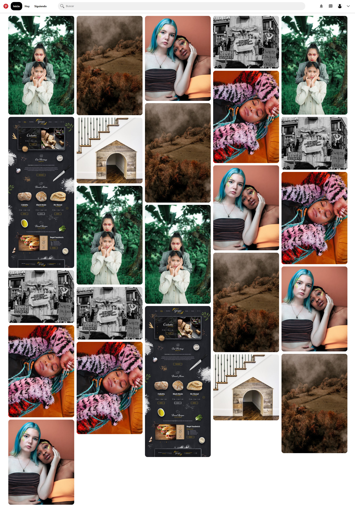

# Pinterest-Layout
Practica de maquetación emulando el diseño de Pinterest.

## Características
* Solo se hizo uso de **HTML y CSS.**
* El header fue organizado utilizando **Flexbox.**
* El efecto de **Masonry** fue resuelto con columnas.
* Se aplico una regla de **Medica Query** para modificar adaptar el menu en resoluciones menores a 1000px.

